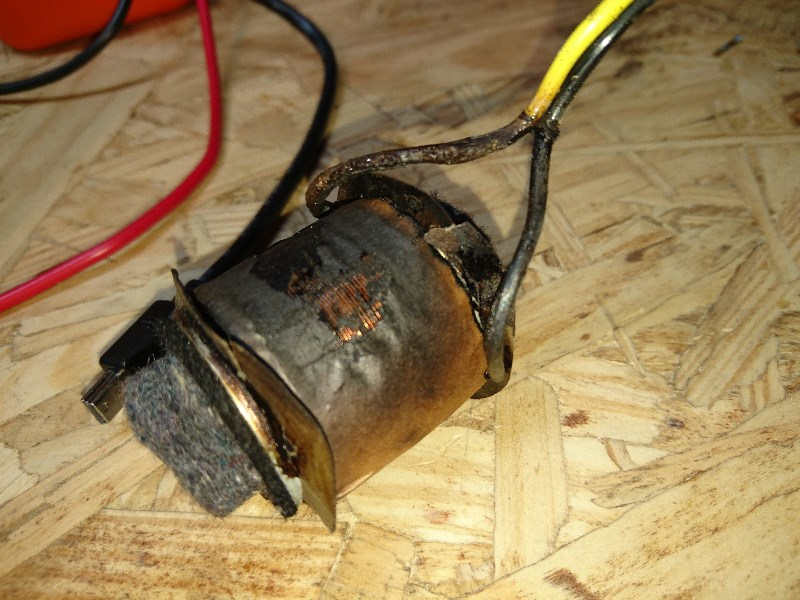
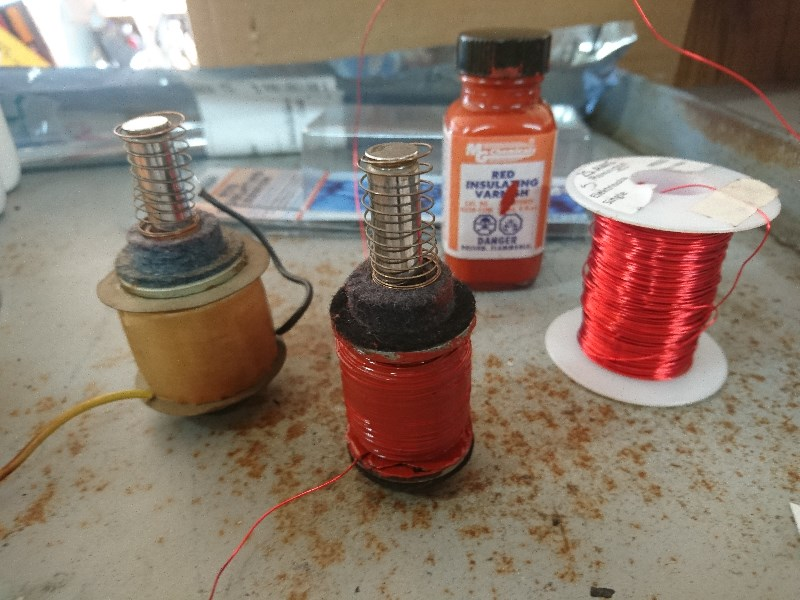

# Burnt Coil Rebuild

One of the coils for the chime was overheated and damaged. It measured
approximately half the impedance of the normal coils, and was visibly burnt.

The high current through this coil was causing problems for the transistor I
selected for the driver board, so I decided to re-wind the coil.

## Original Winding

To start, I removed the existing windings by hand. The first 5 layers were all
50 turns per layer, so I stopped counting turns and started counting layers. I
still periodically verified the layers were 50 turns, and they were throughout.

### Turns

Final result: **950 turns** (50 turns per layer, 19 layers)

It is technically possible I mis-counted layers, and it is actually 1000 turns
(20 layers), but I was careful, so I think it actually is 950 turns.

### Wire

Wire is 0.018" ± 0.0005" (indicated) based on my measurements with a cheap
Harbor Freight digital caliper. That puts it at a nominal 24 or 25 gauge.

Total wire length removed is approximately 250' (measured with a tape measure).

Calculating the expected resistance for 250' of 25 AWG wire yields 8.09 ohms,
which matches the other coils (8.0 ohms on my meter).

I think it is safe to say the coil uses **25 AWG** magnet wire.

## Core

The coil core was then exposed, and was measured.

The center section was not actually round, but narrowed in the center slightly.
The outer edges are 14.0 mm in diameter, and the center is 13.5 mm in diameter.

The winding section is 31 mm long, though the original winding didn't take the
whole area, but was centered on it. I was unable to get a good measurement of
the original winding width, but it appeared to be about 22-25 mm wide.

## New Winding

I ordered 25 AWG magnet wire, and used my lathe to re-wind the burnt coil with
new wire. I didn't have the proper paper for separating layers, so I used
standard multi-purpose copy paper soaked with insulating varnish. Not ideal, but
it worked.

I ended up winding the coil with more turns per layer and less layers than the
original. The rebuilt coil measures 7.2 ohms, so a little low, but way better
than the sub-4 ohm resistance from before.

The new coil tests out fine using a bench supply, and should be easy to
calibrate with the firmware to match the original coils.
