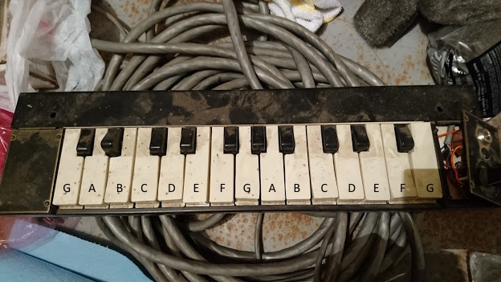

# Chime Notes

This maps the chime notes to MIDI notes.

The keyboard is laid out like such:

 G# A#   C# D#   F# G# A#   C# D#   F#
G  A  B C  D  E F  G  A  B C  D  E F  G

I am not sure which octaves that covers, though. I need to measure the frequency
of the chimes to be sure.

For now, I am going to randomly assume it is G3 (MIDI 55) through G5 (MIDI 79),
since that seems to match a lot of MIDI files I found online for chimes.
